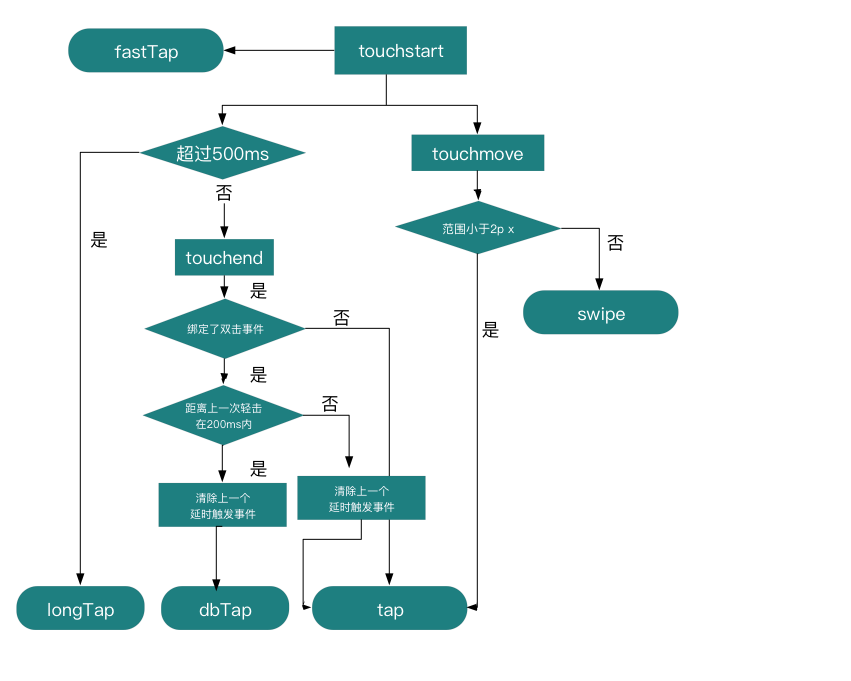

# leen-toucher

轻量级的手势库，支持

* 轻击(tap)
  > 如果未绑定 dbTap，则会尽快响应

  > 如果绑定了 dbTap，延时 190ms，用来判定是否为双击
* 双击(dbTap)
  > 两次Tap间隔在200ms内视为双击
* 滑动
  * swipeStart
  * swipe
    > 滑动中，会停止 tap, dbTap, longTap
  * swipeEnd
  * 添加 swipe 速度阀值属性 (coding...)
* 长按(longTap)
  > Tap 持续500ms，视为长按
* 缩放 (coding...)
* 旋转 (coding...)

## 安装

## 使用

### 使用 state 来传递数据

Toucher 不允许直接在 Toucher实例上扩展属性，但可以通过state 来存储。

> 这是为了防止覆盖 Toucher 内置函数导致程序混乱

state属性在不想定义全局变量的情况下，函数间传递数据是很有用的

```javascript
Toucher(element)
  .swipeStart((e, that) => {
    that.state.myValue = 1
    that.xxxx = 2 // error
  })
  .swipe((e, that)=>{
    console.log(that.state.myValue) // 1
  })
```

## 原理


